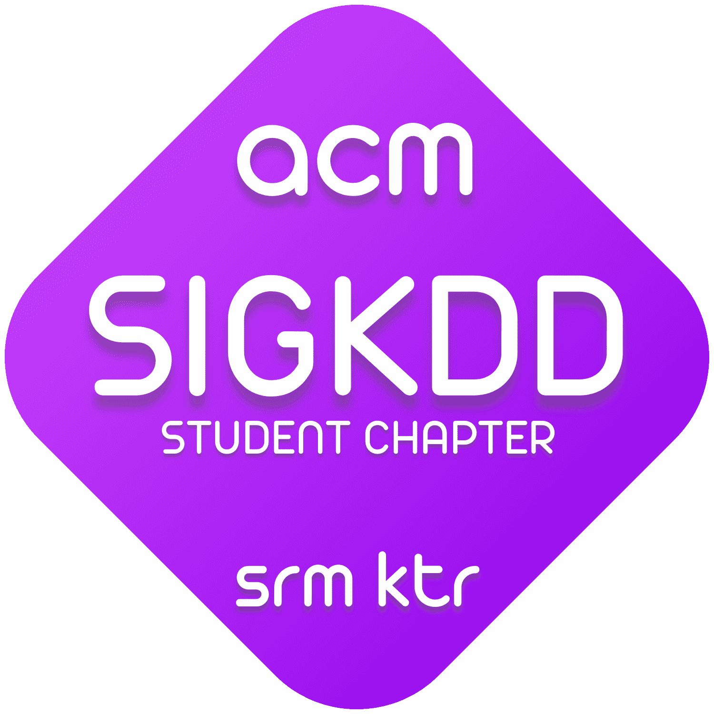
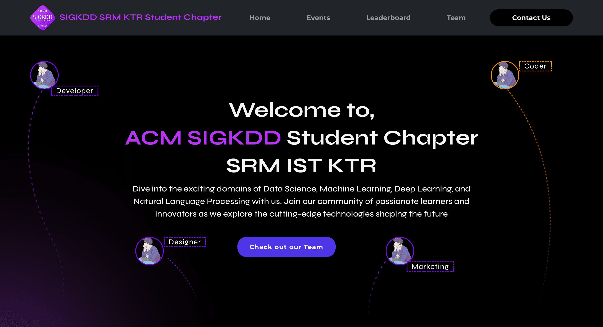
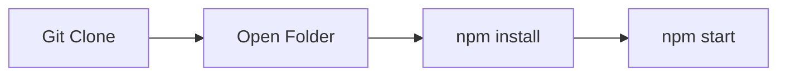

[](https://awesome.re)


<p align="center">
    

</p>
<h1 align="center" >SIGKDD Student Chapter SRM KTR </h1>

  
</p>

Welcome to the official GitHub repository of the ACM SIGKDD Student Chapter at SRM Institute of Science and Technology, Kattankulathur!

This repository serves as the central hub for our Special Interest Group on Knowledge Discovery in Data (SIGKDD) activities. Join us as we explore the fascinating realm of data science and machine learning.

Founded in 2024, our chapter is dedicated to fostering learning, collaboration, and innovation in data science within the SRM community and beyond. Stay tuned for exciting projects, resources, and events. Let's unlock the potential of data together!
<br>

## Demo Screenshot of Home Page


## Setting Up Fortuna

1. Installing Dependencies:
    ```bash
       npm install

2. Starting the Server:
    ```bash
      npm start
<br>

<p>Running website on Local Host</p>



 ## 💻 Current Tech Stack
<div style="display: inline_block"><br>
  
  
  
  
  
</div>

<div><h2><strong>Developer of this project 🔻</strong></h2></div>

<table align="center">
<tr align="center">
<td>

**ADITYA VERMA**

<p align="center">

</p>
<p align="center">
<a href = "https://github.com/ADITYAVOFFICIAL"></a>
<a href = "https://www.linkedin.com/in/aditya-verma-real/">

</a>
<a href = "https://medium.com/@adityaver">

</a>
</p>
</td>
</table>

 ## Current Contributors 🔻
<div align="center">
  <a href="https://github.com/ADITYAVOFFICIAL/Official_Website/graphs/contributors">
  
</a>
</div>

#
<p align="center">Made with ❤️ <b>TEAM ACM SIGKDD SRM KTR </b></p>
